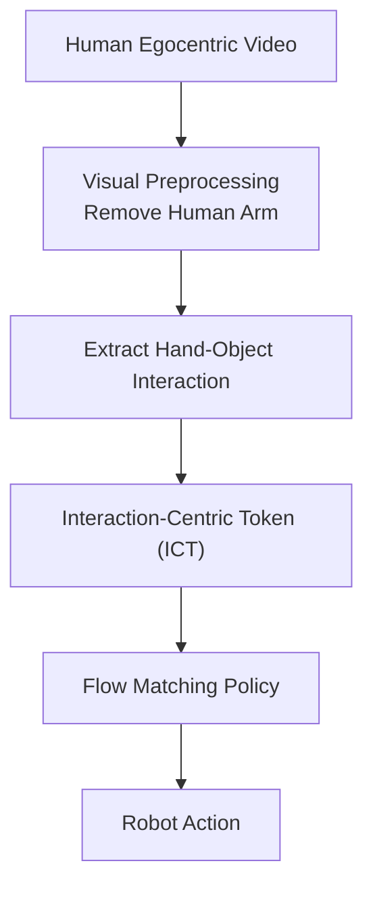

# 1.Ego面临的最大困难

（1）视觉差异 Visual Gap

  同一个动作里，人的画面是胳膊和手，机器人的画面是机械臂和机械手。RGB无法对应，画面不同。

（2）运动学差异 Kinematic Gap

  人的动作和自由度与机械臂和机械手完全不同。

> 因此，从Ego中应该学的内容是Interaction，即交互关系。

# 2.整体流程


其中最核心的创新是 **Interaction-Centric Token (ICT)**，其它模块均围绕 ICT 展开设计。

# 创新一：Interaction-Centric Token（ICT）

## 为什么需要 ICT？

传统 Human-to-Robot Learning 方法主要采用以下三种表示方式：

### Hand-Centric Representation

仅关注人的手部运动（如 Hand Pose、Wrist Trajectory、Finger Keypoints）。这种方法虽然能够描述手的运动轨迹，但无法表达人与物体之间的交互关系。例如，手什么时候接触物体、是否已经完成抓取、当前是接近还是释放等关键信息，都无法从中直接获得。

### Object-Centric Representation

另一类方法只关注物体（如 Object Pose、Object Trajectory）。这种表示能够描述物体如何运动，但无法解释为什么物体会移动、是左手还是右手推动的、以及当前是否已经抓住。也就是说，仅有物体状态无法恢复完整的操作过程。

### Point-based Representation

近年来大量工作（如 PointPolicy、Track2Act、EgoZero）采用 Point Tracking，通常追踪数百甚至数千个关键点。这些点虽然能够描述运动，但缺少明确的语义。模型不知道哪些点属于左手、哪些点属于右手、哪些点属于物体，因此整体的学习效率较低。

## HumanEgo 的核心思想

论文认为：“_Manipulation is defined by hand-object interaction rather than hand or object alone._” 也就是说，**机器人真正需要学习的是 Hand 与 Object 之间的交互关系，而不是手或者物体本身。** 因此，作者提出了 **Interaction-Centric Token (ICT)**。

## ICT 的结构

论文将场景中的每一个实体（Entity）表示为一个 Token。实体包括左手、右手以及每一个物体，每个 Entity 都对应一个 ICT：

```python
ICT = [Entity Type, Entity Pose, Left Hand Relative Pose, Right Hand Relative Pose, Grasp State]
```

其中包含五类信息：

1. **Entity Type**：用于表示当前 Token 对应的实体类型（如 Hand 或 Object），让模型首先知道当前描述的是哪个实体。
    
2. **Entity Pose**：表示当前实体在世界坐标系中的位姿（Position & Rotation，即 $x, y, z$ 和 rotation），用于描述实体自身的位置。
    
3. **Left Hand Relative Pose**：记录左手相对于当前实体的位置关系。这里不是保存左手的绝对坐标，而是保存左手相对于该物体（如杯子）的空间关系（例如：距离 2 cm，方向 Front）。
    
4. **Right Hand Relative Pose**：同理，保存右手相对于当前实体的位置关系。因此，每一个物体都能实时感知到左手和右手在哪里。
    
5. **Grasp State**：最后增加一个抓取状态（如 0 表示未抓取，1 表示已经抓取）。对于手来说，Grasp State 是根据手部关键点估计得到的。
    
## 为什么 ICT 有效？

传统方法一般保存的是绝对坐标（如 Hand 在 `(0.52, 0.38, 0.81)`，Cup 在 `(0.56, 0.39, 0.80)`），模型需要自己去艰难地学习距离、接近、接触和抓取等相对关系。

而 ICT 直接编码了相对交互（如 Cup 相对 Left Hand 的 Distance = 2 cm，Grasp = True）。因此，机器人学习的是一个高层级的操控序列（`Approach` $\rightarrow$ `Grasp` $\rightarrow$ `Lift` $\rightarrow$ `Move` $\rightarrow$ `Release`），整个 Manipulation Sequence 都被高效地编码到了 Token 中。ICT 本质上 class 是一种 **Interaction Representation**，而不是单纯的 Pose Representation。

# 创新二：Visual Embodiment Gap Bridging

## 问题与解决方案

Human Video 与 Robot Observation 存在明显的视觉差异（Domain Gap），训练时看到的是 Human Hand，而部署时看到的则是 Robot Gripper，直接训练会产生较大的跨域问题。

为了解决这一痛点，论文提出了 **Arm Inpainting** 与 **Virtual Gripper Rendering**。首先，利用 SAM2 将人的手和前臂全部分割出来，随后使用 LaMa 完成背景修复，得到没有人手的干净场景图像。接着，系统在对应位置渲染一个虚拟机器人夹爪（Virtual Gripper）。

最终网络的输入由单纯的 `Human Hand` 变成了 `Robot Gripper + Object`，使视觉输入更加接近机器人实际部署时的观察。需要注意的是，论文消融实验表明，**视觉预处理能够带来一定提升，但真正决定性能的核心仍是 ICT。**

# 创新三：Flow Matching Policy

策略网络采用了近年来较新的 **Flow Matching** 框架，而不是传统的 Diffusion Policy。

Diffusion Policy 需要多轮去噪（`Noise` $\rightarrow$ `100次Denoising` $\rightarrow$ `Action`），推理速度较慢。而 Flow Matching 则通过学习连续速度场（Velocity Field）来进行动作生成（`Noise` $\rightarrow$ `Velocity Field` $\rightarrow$ `ODE Integration` $\rightarrow$ `Action`）。相比 Diffusion，Flow Matching 推理速度更快，同时能够保持生成式策略的多模态能力，因而更适合实时机器人控制。

# 创新四：Dense Auxiliary Objectives

论文认为，如果仅利用 `Observation` $\rightarrow$ `Action` 进行端到端监督，会导致学习信号不足。因此，设计了三个辅助任务来提供更密集的监督：

- **Object Motion Prediction**：预测未来物体的运动，通过监督模型学习 `Object Pose(t+1)` 来增强物体的运动建模能力。
    
- **2D Trace Prediction**：预测未来的二维运动轨迹，帮助网络更好地学习视觉运动趋势。
    
- **Latent Consistency**：预测未来的 ICT（即预测未来人与物体之间的交互状态）。相比于直接预测复杂的 RGB 图像，预测低维的高阶 ICT 更容易让网络学习到交互的变化规律。
    

这三个辅助任务分别从三维运动、二维视觉以及交互状态三个维度进行约束，因此能够充分利用每一段视频中的监督信息。在只有几十分钟的数据量时，依然能让机器人获得较好的策略学习效果。

# 方法总结

HumanEgo 的四个创新点可以总结如下：

|**创新点**|**核心思想**|**作用**|
|---|---|---|
|**Interaction-Centric Token (ICT)**|显式编码 Hand-Object Interaction|从交互而不是人体动作中学习 Manipulation，是整篇论文最大的创新。|
|**Visual Embodiment Bridging**|去除人手并渲染机器人夹爪|缩小 Human 与 Robot 的视觉域差异，缓解 Embodiment Gap。|
|**Flow Matching Policy**|使用 Flow Matching 替代 Diffusion|提高动作生成效率，显著降低推理延迟，提升实时性。|
|**Dense Auxiliary Objectives**|增加 Object Motion、2D Trace 和 ICT Prediction 三个辅助监督|充分挖掘视频中的监督信号，在少量训练数据下有效提升策略学习效果。